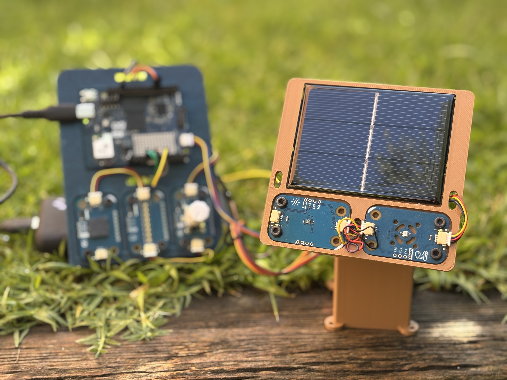
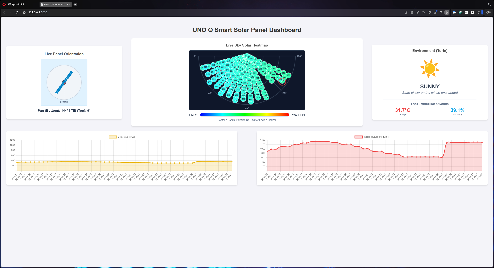
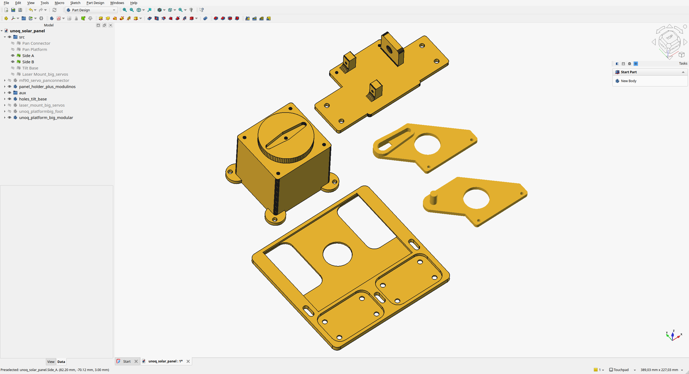

# 🌞 UNO Q Smart Solar Pannel

A small solar pannel system that orient solar pannels automatically to get as much energy as possible, protects them from overheat and extreme weather conditions, and autoclean them using the Arduino UNO Q advanced Edge AI Features.

Youtube video below:

The UNO Q Smart Solar Panel system it is a little project intended to be used to learn about Edge AI applied to Green Energy Systems like Solar Panel systems. It is fully open sourced and you can 3D printed, mount and program it on your own!

[Youtube Video Link](https://youtu.be/w9L78aqJsKc)

## Features

* Fully accesible and Open Source, 3D print the pieces and use the cheap solar panel, servomotors and Modulinos to make it work.
* The system scan the sky and save the information into a database auto orienting the sonal panel to the best position to get more energy at any time.
* The Linux system take cares of Edge AI features, like general forecast, interactive local dashboard and much more, while the microcontroller gets information from the sensors and move the servomotors.
* If the weather forecast is snowy, or there is a sand's storm incoming, the Linux system informs the microcontroller to put the solan panel in emergency mode, keeping the solar panel as vertical as possible to protect it from the sand, snow, etc.
* If it is night or foggy, being too dark to get energy from the sand, the solar panel will read the low values of voltage and put it in home position (panel in horizontal) waiting for the right conditions to get energy again.
* The system is able to get not only read the values from the actual energy of the solar panel, but also get the infrared values of the sun thanks to the Modulino light. Which makes the system more efficient and able to detect where is position to get more energy from the sun.
* Thanks to the Modulino Thermo, system is able to know the temperature and humidity of the solar panel in real time. Protecting the solar panel when temperatures reachs danger limits for the panel like more than 60 celsius degrees.
* The solar panel is able to detect anomaly vibrations thanks to the Modulino IMU, stopping the whole system in case a serious problem is detected.
* The system is able to autoclean itself from dust, snow and sand, thanks to the Modulino Vibro, that makes, like Nasa's martian rovers do, to vibrate the whole solar panel to clean it.

### The real-time dashboard

The project shows on your network a small webpage dashboard with all the information in real time about what is happening.

* The Solar Panel orientation in real-time.
* The Live Sky HeatMap about the solar voltage readings from the solar panel to understand the best position for getting energy and the current position of the solar panel.
* The actual weather forecast of the place where the solar panel is installed and the real-time temperature and humidity of the solar panel itself.
* A real-time graph about the energy taking by the solar panel overtime.
* A real-time graph about the infrared light that the solar panel is getting overtime.

## Hardware Required

- 1x Arduino UNO Q
- 1x Small Solar Pannel of 80 cm x 60 cm with a maximum voltage of 3 VDC.
- 2x Servomotors MG90 to move the solar panel.
- 1x Modulino Movement to detect sanomalies in the movement or even raining drops!
- 1x Modulino Light to read natural and infrared light
- 1x Modulino Vibro to autoclean the solar panel making it to vibrate.
- 1x Modulino Thermo to get the temperature and humidity of the solar panel
- 1x Small Solar Pannel

## Software Required

- Arduino App Lab
- Internet connection

## 3D Printed Parts

You can find the 3D parts to print and Freecad source file at the folder "3D Models" inside this repository.

### 3D Printing

No special instructions are required to print your solar panel. Standard PLA is a good material to use but if you are going to put your solar panel long hours exposed to the sun can be melted easily, consider to print the parts in PETG if that is the case.
No supports are required. Use standard 15%/20% Infill and a nice 0.2 layer height.

### Assembly

Assembly is extremely easy, just follow the original instructions [here](https://www.hackster.io/TheSmallWonder/pan-tilt-assembly-for-mg90s-servos-da32c).

### Credits about the 3D parts

The design was created using as a base the project made by "The Small Wonder"

[Pan & Tilt Assembly for MG90S Servos](https://www.hackster.io/TheSmallWonder/pan-tilt-assembly-for-mg90s-servos-da32c6)

This design was used as base and some piece reused while another new parts were totally created from scrach, some of the were customized. Use the Freecad file to make your own modifications if need, like adapting the solar panel holder piece for any other kind of solar panel!

## License

This project was created by Julián Caro Linares for Arduino INC under an Open Source Creative Common Share Alike license, CC-BY-SA

